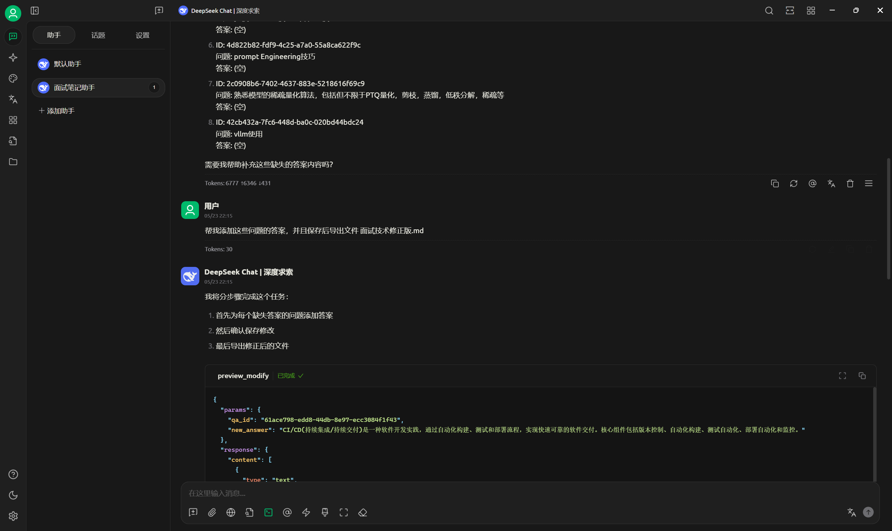

# 基于知识图谱的笔记系统
[](https://deepwiki.com/Xikcn/KnowledgeMapNotes)

## 项目展示
https://github.com/user-attachments/assets/5e9e6ffd-4e18-4915-b3a4-85198eb8bb0f


## 项目简介
本系统通过将PDF等文档自动转化为知识图谱，实现高效的知识管理、智能检索与问答。系统支持关系权重机制、社区智能推荐、知识融合、可视化等多项创新功能，适用于学术笔记、知识管理、智能问答等场景。

## 主要功能
- **PDF/MD文档自动处理与知识抽取**
- **知识图谱自动构建与融合**（支持多关系融合、权重计算）
- **智能问答（HybridRAG）**，支持上下文与知识图谱结合
- **知识图谱可视化**（实体/关系搜索、高亮、权重粗细展示）
- **基于权重的关系筛选与社区发现**（支持阈值与TopN筛选）
- **增量更新与知识库管理**
- **API接口丰富，参数灵活可控**

## 技术架构
- **后端**：FastAPI、ChromaDB、SentenceTransformers、NetworkX、OpenAI/百炼大模型
- **前端**：Vue3、Element Plus
- **其他**：多线程/异步处理、环境变量灵活配置

## 系统架构
- 文档处理模块：负责PDF文档的解析和文本提取
- 知识图谱模块：实现实体识别、关系抽取、权重计算和知识图谱构建
- 检索模块：基于向量数据库的语义检索
- 权重筛选模块：基于重要性权重筛选和排序关系
- API服务：FastAPI实现的RESTful接口
- 前端应用：Vue3实现的用户界面

## 配置文件管理
系统通过环境变量配置文件(.env)灵活管理模型和功能设置，关键配置参数包括：

### 基础配置
- `UPLOAD_FOLDER`：文件上传目录
- `TXT_FOLDER`：处理后文本存储目录
- `RESULT_FOLDER`：结果输出目录
- `CHROMADB_PATH`：向量数据库存储路径

### 模型配置
- `MODEL_NAME`：使用的LLM模型名称
- `TEMPERATURE`：模型温度参数
- `API_KEY`：LLM API密钥
- `BASE_URL`：LLM API基础URL
- `EMBEDDINGS`：嵌入模型名称
- `EMBEDDINGS_PATH`：本地嵌入模型路径
- `DEVICE`：运行设备（cuda/cpu）

### 多模态配置
- `VL_API_KEY`：视觉语言模型API密钥
- `VL_BASE_URL`：视觉语言模型API基础URL

### 功能开关
- `IS_USE_LOCAL`：是否使用本地模型（True/False）
- `SPLITTER_MODE`：文本分割器模式（SemanticTextSplitter/SimpleTextSplitter）

### 配置示例
```
# 基础路径配置
UPLOAD_FOLDER=./uploads
TXT_FOLDER=./txt_files
RESULT_FOLDER=./results
CHROMADB_PATH=./chroma_data

# 模型配置
MODEL_NAME=gpt-3.5-turbo
TEMPERATURE=0.7
API_KEY=your_api_key
BASE_URL=https://api.openai.com/v1
DEVICE=cpu

# 嵌入模型配置
EMBEDDINGS=BAAI/bge-base-zh
EMBEDDINGS_PATH=D:/Models_Home/Huggingface/hub/models--BAAI--bge-base-zh/snapshots/0e5f83d4895db7955e4cb9ed37ab73f7ded339b6
IS_USE_LOCAL=True

# 多模态配置
VL_API_KEY=your_vl_api_key
VL_BASE_URL=https://dashscope.aliyuncs.com/compatible-mode/v1

# 功能配置
SPLITTER_MODE=SimpleTextSplitter
```

通过修改这些配置参数，可以灵活切换不同的模型、调整性能参数和控制功能开关，无需修改代码即可适应不同的部署环境和使用场景。

## 权重功能详解
系统创新性地引入了0-1之间的关系权重机制，用于表示实体间关系的重要性：
- 提取关系时自动计算权重，反映关系在当前语境中的重要程度
- 知识融合过程保留权重信息，对冲突关系进行权重融合
- 可视化时通过边的粗细直观展示关系重要性，重要关系线条更粗
- 社区查询支持权重阈值筛选，只返回权重大于阈值的关系
- 查询结果按权重排序，确保最重要的信息优先展示
- API支持weight_threshold和max_relations参数，灵活控制结果

## 详细使用说明
### 文档上传与处理
1. 访问系统首页，点击"上传文档"按钮
2. 选择要上传的PDF文件，点击确认
3. 系统会自动处理文档并构建知识图谱
4. 处理完成后，可以在文档列表中查看已上传的文件

### 知识图谱查询
1. 在文档列表中选择要查询的文档
2. 点击"查看知识图谱"按钮
3. 系统会显示文档的知识图谱可视化结果
4. 可以通过点击节点查看详细信息，或者使用搜索功能定位特定实体
5. 悬停在关系线上可以查看关系详情和权重信息

### 智能问答
1. 在文档列表中选择要问答的文档
2. 点击"开始问答"按钮
3. 在输入框中输入问题
4. 系统会基于文档内容和知识图谱提供回答
5. 可以调整权重阈值，筛选更重要的知识进行回答

## Docker部署安装
### 环境要求
- Docker已经启动
1. 创建并配置`.env`文件
```bash
# 复制配置模板（如果存在）或手动创建
cp .env.docker .env

```

2. 关键配置说明
   - 必须配置的项: API_KEY、BASE_URL
   - 如果使用本地模型: 设置IS_USE_LOCAL=True并配置EMBEDDINGS_PATH
   - 可选的视觉功能: 配置VL_API_KEY和VL_BASE_URL

3. 启动构建
```bash
# 启动所有服务
docker-compose up --build

# 或在后台运行
docker-compose up -d --build

```

4. 访问前端
http://localhost:8080

## 本地安装与使用
### 环境要求
- Python 3.10+
- Node.js 16+
- 推荐GPU环境（可选）

### 环境配置
1. 创建并配置`.env`文件
```bash
# 进入后端目录
cd backend
# 复制配置模板（如果存在）或手动创建
cp .env.example .env

```

2. 关键配置说明
   - 必须配置的项: API_KEY、BASE_URL
   - 如果使用本地模型: 设置IS_USE_LOCAL=True并配置EMBEDDINGS_PATH
   - 可选的视觉功能: 配置VL_API_KEY和VL_BASE_URL

## API服务申请
### 获取视觉模型（如果不开启可以不用）
https://bailian.console.aliyun.com/?tab=api#/api
```pycon
vl_client = OpenAI(
    # 若没有配置环境变量，请用百炼API Key将下行替换为：api_key="sk-xxx"
    api_key='sk-xx',
    base_url="https://dashscope.aliyuncs.com/compatible-mode/v1",
)
```

### 嵌入模型的使用
建议下载到本地离线处理（Huggingface）也可以使用网络库，会自动下载到本地，第二次换成本地可以快速启动
如果无法下载建议，去Huggingface官网下载到本地，直接使用本地模型
* 添加镜像
```python
import os
os.environ['HF_ENDPOINT'] = 'https://hf-mirror.com'
```

* bge-base-zh本地模型使用
```python
from sentence_transformers import SentenceTransformer
# 初始化模型和组件
# embeddings = SentenceTransformer('BAAI/bge-base-zh').to(device)
embeddings = SentenceTransformer(
    r"D:\Models_Home\Huggingface\hub\models--BAAI--bge-base-zh\snapshots\0e5f83d4895db7955e4cb9ed37ab73f7ded339b6"
    )
```

### 后端安装
```bash
# 进入后端目录
# 安装依赖
pip install -r requirements.txt
# uv安装依赖
# uv pip install -r requirements.txt
# 启动服务
python main.py
```

### 前端安装
```bash
# 进入前端目录
cd frontend
# 安装依赖
npm install
# 启动开发服务器
npm run dev
```

### 完整部署流程
1. 克隆仓库
```bash
git clone https://github.com/Xikcn/KnowledgeMapNotes.git
cd KnowledgeMapNotes
```

2. 安装后端依赖
```bash
pip install -r requirements.txt
```

3. 安装前端依赖
```bash
cd frontend
npm install
```

4. 构建前端（生产环境）
```bash
npm run build
```

5. 启动后端服务
```bash
# 进入后端目录
cd backend
python main.py
```

6. 访问系统
浏览器中打开 http://localhost:8080

## 目录结构
- `app.py`: 主应用入口
- `OmniText/`: 文本处理模块
- `KnowledgeGraphManager/`: 知识图谱管理模块
- `LLM/`: 大语言模型交互
- `TextSlicer/`: 文本分割工具
- `embedding_tools/`: 向量嵌入工具
- `projects/vue/`: 前端Vue项目
- `prompt/`: 提示词模板
- `chroma_data/`: 向量数据库存储
- `uploads/`: 上传文件存储
- `txt_files/`: 处理后文本存储
- `results/`: 结果输出目录
- `docs/`: 文档说明
- `lib/`: 通用库函数
- `output/`: 临时输出文件
- `images/`: 图片资源

## 常见问题
### Q: 系统支持哪些类型的PDF文件？
A: 系统支持大多数标准PDF文件，包括文本PDF和扫描PDF（需OCR）。

### Q: 如何更新知识图谱？
A: 重新上传文档或使用增量更新功能可更新知识图谱。

### Q: 如何调整权重阈值？
A: 在API调用时通过weight_threshold参数设置，或在前端界面通过相应控件调整。

### Q: 权重值如何计算？
A: 系统根据关系在文本中的重要性、出现频率和语境自动计算权重值，范围为0-1。

### Q: 如何切换到不同的语言模型？
A: 在.env文件中修改MODEL_NAME和相应的API_KEY、BASE_URL参数，系统会自动加载新的模型配置。

### Q: 如何优化系统性能？
A: 对于大型文档，可以调整SPLITTER_MODE为SemanticTextSplitter获得更好的分块效果；在GPU环境中将DEVICE设置为cuda可以显著提升嵌入计算速度。
注意：使用cuda需要安装torch的gpu版本，cpu版本不需要安装torch

## 待完成的功能
- 对于实体可联网获取相关知识，如果当前知识图谱无法解决（待新增）
- 文本分块进行RAG的部分有问题（有些文本丢失）
- 生成试卷进行学生的复习（允许联网生成易错选项）
- 对上传的笔记可以进行检查功能，如有存在公理上的错误则提示用户进行修改
- 允许用户对问题回答生成讲解视频

## 即将完善的功能
- 采用更优秀的社区搜索方式
- 隐私数据进行脱敏与还原，保证用户隐私安全
- 文本处理构建的进度显示，就是处理分块的数量/总数
- 知识图谱渲染方式
- 对向量和三元组关系的融合

## 可替换的技术栈
* mineru 用于pdf转markdown，替换多模态2txt功能

## 外部额外功能整合
- **支持qa类型笔记，配合qa笔记工具与对于MCP服务即可使用ai完成知识的整理**
- **详细可见：https://github.com/Xikcn/QAlite**


##### 旧版演示视频
https://github.com/user-attachments/assets/5b62e85b-1340-4b79-814c-994380a8e146

## 许可证
MIT

---

